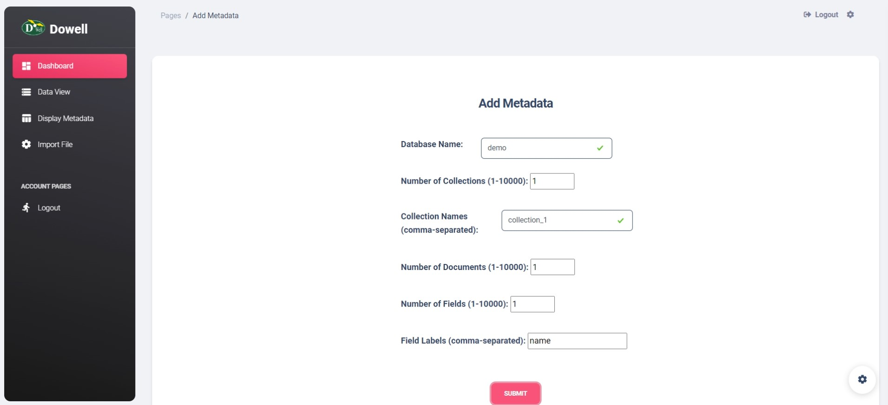
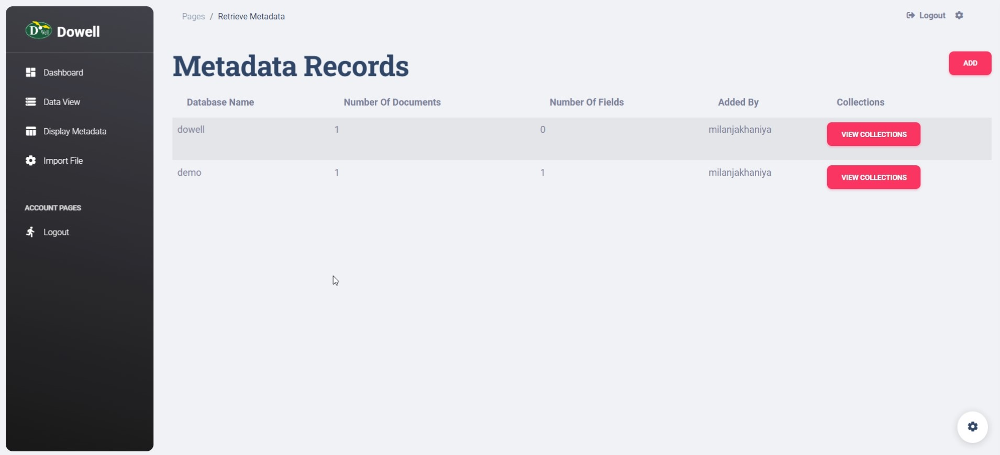
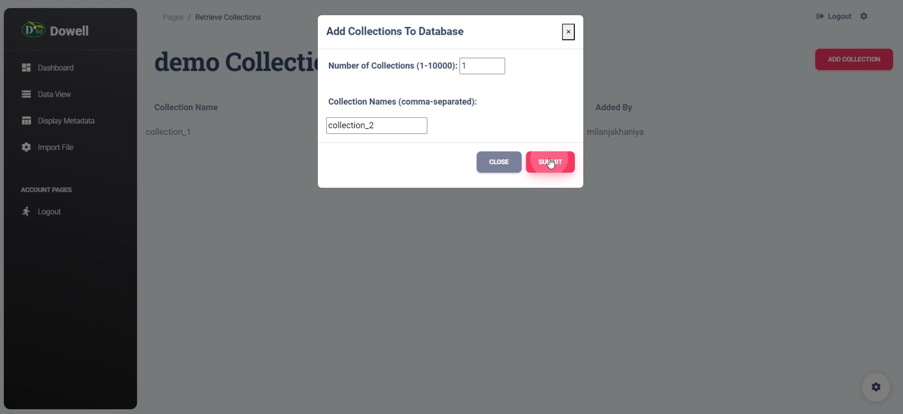
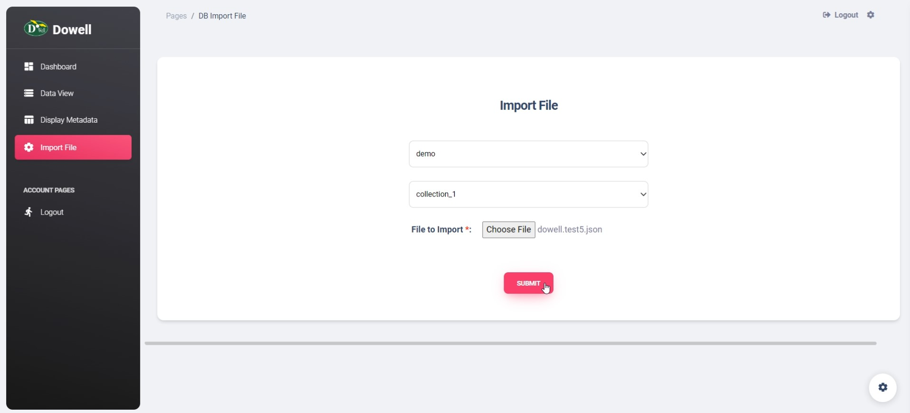
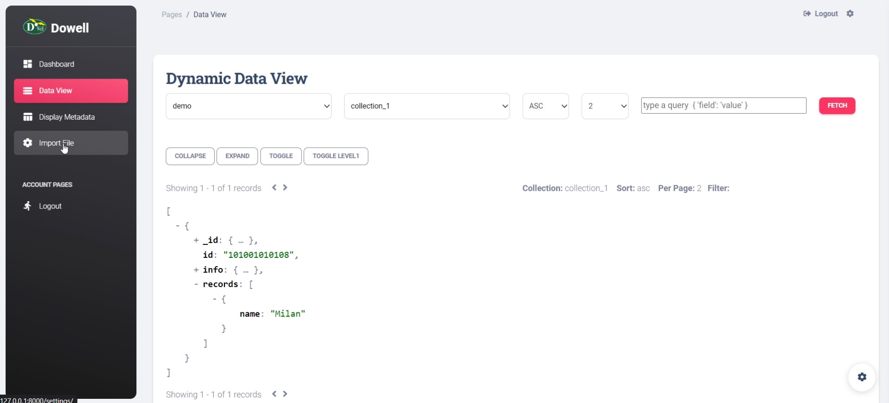

# DoWell DataCube from DoWell UX Living Lab

Welcome to the DoWell DataCube! The DoWell DataCube is a platform that offers centralized data management, enabling users to create custom databases and access them through APIs.
This documentation contains in-depth information on how to utilize the DoWell DataCube API for data insertion, retrieval and updation.

## Getting Started

To begin using the DataCube API, you need to generate an API key. The process is seamless and straightforward. Follow the steps below to create your API key:

1. Visit the DoWell website at [www.uxlivinglab.com](https://dowellstore.org/).
2. Navigate to the API section and click on "Get API Key."

## API Description

Use of these APIs allows you to interact with a database and perform CRUD operations such as fetching data, inserting data and updating data.

# Steps to use DoWell DataCube and APIs
There are two main steps to use DoWell DataCube


## Step 1: Add request for database
To submit a request for the database, please begin by logging into DataCube. You can access the login page by clicking on the following link: [DataCube Login](https://datacube.uxlivinglab.online/). <br>
Once you have successfully logged in, you will be redirected to the dashboard. From there, you can enter your request for the database.


<br>
<br>
After submitting your request for the database, you'll have the ability to view the created database and its associated collections. <br>
By clicking on "View Collection," you can access and inspect all the collections within the relevant database. <br>
Moreover, you also have the option to add additional collections to the database if needed


<br>
<br>
You also have the option to import JSON or CSV files to add documents to a collection.

<br>
<br>

You can also view the data in a data view by selecting the database and collection from the dropdown menu.

<br>
<br>
After adding the database and collection, you can now utilize APIs to add, retrieve, and update data within the database.

## Step 2: Use Database using APIs
Click here to read the documentation in postman [Documentation](https://documenter.getpostman.com/view/29895764/2s9YRB1WyN)

# API Detailed Documentation
=============================================================================
## Fetch Data Using the API

### URL: https://datacube.uxlivinglab.online/db_api/get_data/
### Method: POST

This API enables you to retrieve data from a specific collection in the Dowell database based on a query.

#### Request Data / API Payload

```json
{
    "api_key": "your-dowell-api-key",
    "db_name": "dowell",
    "coll_name": "test",
    "operation": "fetch",
    "filters": {
         "_id": "101001010101"
    },
    "limit": 1,
    "offset": 0
}
```

#### Parameters

- `api_key` (required): Your Dowell API key.
- `db_name`: The name of the database.
- `coll_name`: The name of the collection to fetch data from.
- `operation`: The operation type, which is "fetch" for this request.
- `filters`: A JSON object specifying the query criteria.
- `limit` (optional): The maximum number of records to retrieve per page.
- `offset` (optional): The page number for pagination.

#### Example of Fetching Data in Python

```python
import requests
import json

url = "https://datacube.uxlivinglab.online/db_api/get_data/"

data = {
    "api_key": "your-dowell-api-key",
    "db_name": "dowell",
    "coll_name": "test",
    "operation": "fetch",
    "filters": {"_id": "101001010101"},
    "limit": 1,
    "offset": 0
}

response = requests.post(url, json=data)
print(response.text)
```

#### Response:

- For success: `{"data": "[]"}` (an empty array in this example)
- For error: `{"message": "Database not found"}`

## Insert Data

### URL: https://datacube.uxlivinglab.online/db_api/crud/
### Method: POST

Use this API to add data to a specific collection within the Dowell database.

#### Request Data / API Payload

```json
{
    "api_key": "your-dowell-api-key",
    "db_name": "dowell",
    "coll_name": "test",
    "operation": "insert",
    "data": {
        "id": "101001010101",
        "info": {"name": "dowell"},
        "records": [{
            "record": "1",
            "type": "overall"
        }]
    }
}
```

#### Parameters

- `api_key` (required): Your Dowell API key.
- `db_name`: The name of the database.
- `coll_name`: The name of the collection for data insertion.
- `operation`: The operation type, which is "insert" for this request.
- `data`: The data to be inserted as a JSON object.

#### Example of Inserting Data in Python

```python
import requests
import json

url = "https://datacube.uxlivinglab.online/db_api/crud/"

data = {
    "api_key": "your-dowell-api-key",
    "db_name": "dowell",
    "coll_name": "test5",
    "operation": "insert",
    "data": {
    "id": "101001010101",
    "info": {'name': "dowell"},
    "records": [{
        "record": "1",
        "type": "overall"
    }]
}
}

response = requests.post(url, json=data)
print(response.text)
```

#### Response:

- For success: `{"message": "Data inserted successfully!"}`
- For error: `{"message": "Database not found"}`

**Note: If a user tries to add more than 10,000 documents in the same collection, the following error will be received:**

For error: `{"message": "Sorry, You can not allow to add more than 10,000 documents."}`

## Update Data

### URL: https://datacube.uxlivinglab.online/db_api/crud/
### Method: PUT

Use this API to update data in a specific collection within the Dowell database.

#### Request Data / API Payload

```json
{
    "api_key": "your-dowell-api-key",
    "db_name": "dowell",
    "coll_name": "test",
    "operation": "update",
    "query": {"_id": "64f6fac8ac03855a010559f2"},
    "update_data": {
        "id": "101001010101",
        "info": {"name": "dowell"},
        "records": [{
            "record": "1",
            "type": "overall_updated"
        }]
    }
}
```

#### Parameters

- `api_key` (required): Your DoWell API key.
- `db_name`: The name of the database.
- `coll_name`: The name of the collection to update data in.
- `operation`: The operation type, which is "update" for this request.
- `query`: Query or filter the record you want to update.
- `update_data`: The data to be updated, is provided as a JSON object.

#### Example of Updating Data in Python

```python
import requests
import json

url = "https://datacube.uxlivinglab.online/db_api/crud/"

data = {
    "api_key": "your-dowell-api-key",
    "db_name": "dowell",
    "coll_name": "test",
    "operation": "update",
    "query" : {"_id": "64f6fac8ac03855a010559f2"}
    "update_data": {
    "id": "101001010101",
    "info": {'name': "dowell"},
    "records": [{
        "record": "1",
        "type": "overall_updated"
    }]
}
}

response = requests.put(url, json=data)
print(response.text)

```

#### Response:

- For success: `{"message": "1 document updated successfully!"}`
- For error: `{"message": "Database not found"}`

## Delete Data

### URL: https://datacube.uxlivinglab.online/db_api/crud/
### Method: DELETE

Use this API to remove data from a specific collection within the Dowell database.

#### Request Data / API Payload

```json
{
    "api_key": "your-dowell-api-key",
    "db_name": "dowell",
    "coll_name": "test",
    "operation": "delete",
    "query": {
        "id": "101001010101"
    }
}
```

#### Parameters

- `api_key` (required): Your Dowell API key.
- `db_name`: The name of the database.
- `coll_name`: The name of the collection from which data will be deleted.
- `operation`: The operation type, which is "delete" for this request.
- `query`: Query or filter the record you want to delete.

#### Example of Deleting Data in Python

```python
import requests
import json
url = "https://datacube.uxlivinglab.online/db_api/crud/"

data = {
    "api_key": "your-dowell-api-key",
    "db_name": "dowell",
    "coll_name": "test",
    "operation": "delete",
    "query": {
        "_id": "64f6fac8ac03855a010559f2",
    }

}
response = requests.delete(url, json=data)
print(response.text)

```

#### Response:

- For success: `{"message": "1 document deleted successfully!"}`
- For error: `{"message": "Database not found"}`

```markdown

### Add Collection to Database

### URL: https://datacube.uxlivinglab.online/db_api/add_collection/
### Method: POST

The Metadata View API allows you to add collections to a specified database within the DoWell DataCube platform. This API provides endpoints for adding and managing collections, making it a powerful tool for data organization and management.

#### Request Data / API Payload

```json
{
    "api_key": "your-dowell-api-key",
    "db_name": "dowell",
    "coll_names": "Collection_4",
    "num_collections": 1
}
```
#### Parameters

- `api_key` (required): Your Dowell API key.
- `db_name`: The name of the database.
- `coll_names`: The name of the collection for add in existing database.
- `num_collections`: as per usecase give num of collections

#### Response:

```json
{
    "success": true,
    "message": "Collection added successfully!",
    "data": []
}
```


## Add Collection to Database

### Example of Add Collection to Database in Python

```python
import requests

url = "https://datacube.uxlivinglab.online/db_api/add_collection/"

data_to_add = {
    "api_key": "your-dowell-api-key",
    "db_name": "doWell",
    "coll_names": "Collection_4",
    "num_collections": 1
}

response = requests.post(url, json=data_to_add)
print(response.text)
```

### Response Codes

- For success: HTTP 200 OK with a JSON response containing a success message.
- For errors: HTTP status codes such as 404 Not Found or 400 Bad Request with an error message.

**Note:** Ensure you replace placeholders such as `"your-dowell-api-key"` and other specific details with actual values in your requests.

```
This documentation provides a comprehensive guide on how to interact with the Dowell Data Cube API, including fetching data, inserting, updating, and deleting records. Please ensure you have the necessary API key and valid data to perform these operations successfully.
